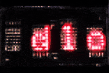

# Micropython simple driver for DLO1414 alphanumeric inteligent display.




The code was developed and tested on a Raspberry Pi Pico because of the sufficiently large number of free gpio pins.
The display is directly controlled without the help of expanders or shift registers, so it requires ten free pins in the microcontroller to work properly.
At the moment the library supports only one display at a time (unfortunately I only own one unit).

### Library functions:
---
```
init(d0,d1,d2,d3,d4,d5,d6,a0,a1,wr)
```
Initialise library and assign display pins to device gpio pins.

parameters:
- **d0 - d7** - data pins numbers
- **a0 - a1** - address pins numbers
- **wr** - write pin number
---
```
write_char(pos, char)
```
Write single character at given position to display.

parameters:
- **pos** - character position (0-4)
- **char** - single character to display
---
```
write_str(text)
```
Write string to display. Function displays only first four characters from given strings. 

parameters:
- **text** - text to display
---
```
scroll_text(text, delay_ms)
```

Display scrolled text from right to left.

parameters:
- **text** - text to scroll
- **delay_ms** - delay between next characters to display (default is 200ms).
---
```
clear()
```

Clear display.

---

### Code examples:

```
# hello world example
from alphanum import dlo1414 as dlo
dlo.init(0,1,2,3,4,5,6,7,8,9)
dlo.clear()
dlo.scroll_text("Hello world", 250)
```

```
# receive text from serial port
# and display (scroll) it on display.
from alphanum import dlo1414 as dlo
dlo.init(0,1,2,3,4,5,6,7,8,9)
dlo.clear()
while 1:
  text = input()
  dlo.scroll_text(text)
```
